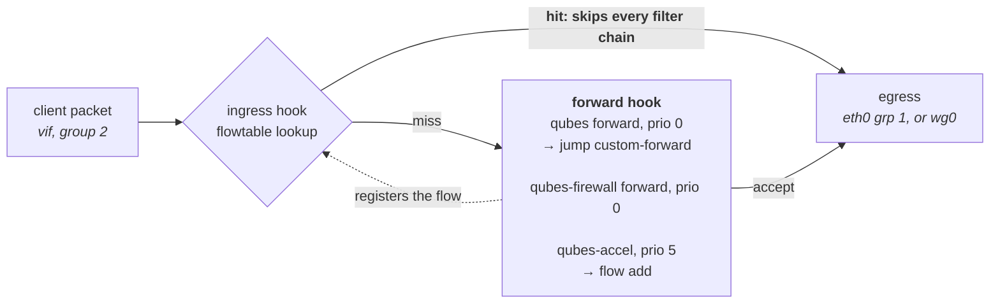

# Design

Why wgq is built the way it is, and what each decision rests on.

Most of the choices here look arbitrary until you know the upstream
behaviour that forced them, so every one cites the file it came from. Where
a decision contradicts a published guide, that is called out — not to score
points, but because you will find the other guide first and should know why
this differs.

Design as of August 2026, read against Qubes OS 4.3.

---

## 1. The problem

Run WireGuard in a Qubes proxy qube and you get a working tunnel almost
immediately. Getting one that *fails safely* is the hard part, and it is
where the existing guides stop.

Three things have to hold:

1. When the tunnel is down, client traffic goes **nowhere** — not out the
   uplink in the clear, not slowly, not partially.
2. When the VPN qube is compromised, it can still only reach the endpoints
   you allowed.
3. When something is misconfigured, you find out — rather than getting a
   qube that quietly forwards in the clear.

Everything below follows from those.

---

## 2. Topology

```
sys-net ── sys-firewall ─┬─ sys-vpn-work ── sys-firewall-work ── [client qubes]
                         ├─ wgq-mgmt                             (provisioning only)
                         └─ sys-whonix                           (optional)
```

**A second firewall qube downstream of the VPN qube.** Qubes states that
running networking services in a qube that also runs the Qubes firewall
service is unsupported, and prescribes exactly this shape:
`sys-net <-> sys-firewall-1 <-> network service qube <-> sys-firewall-2 <-> clients`.

Three things follow from it:

- Firewall changes inside the VPN qube cannot render the Qubes firewall
  ineffective.
- Compromise of the VPN qube does not reach the firewall qube.
- Clients point at `sys-firewall-work` permanently, so switching which VPN
  backs them is `qvm-prefs sys-firewall-work netvm sys-vpn-other` — one
  command, no client touched.

**One VPN qube per identity zone, not one qube with policy routing.** This
is forced, not chosen. Client traffic reaches the VPN qube appearing to come
from `sys-firewall-work`, because that qube masquerades. Per-client policy
inside the VPN qube is therefore impossible. Separate qubes are the only way
to keep zones apart.

**`wgq-mgmt` is not behind the VPN.** A management qube that needs the
tunnel to reach the provider cannot fix a broken tunnel, and sending
account authentication through a tunnel keyed to that same account is its
own problem.

**No firewall qube between `sys-vpn-*` and `sys-whonix`.** Whonix-Gateway
does not respect the qubes-firewall service, so rules on qubes behind it
have no effect. It would buy nothing.

---

## 3. Layers

| Layer | Enforced by | Survives VPN qube compromise |
|---|---|---|
| `qvm-firewall` endpoint allowlist | `sys-firewall`, upstream | **Yes** |
| `sys-firewall-<zone>` | a separate Xen domain | **Yes** |
| `/etc/qubes/qubes-firewall.d/50-wgq` | inside the VPN qube | No |

**Layer 1 is the real protection.** The rules live in dom0 at
`/var/lib/qubes/appvms/<vm>/firewall.xml` and are implemented by the VPN
qube's *net* qube, so they cannot be modified from inside the qube they
constrain. They also fail closed: if the firewall service is not running
when a qube starts, no traffic passes.

The in-qube nftables rules are defence against **tunnel loss**, not against
**compromise**. Anything running as root in that qube can remove them. They
are worth having because tunnel loss is the common failure and compromise
is the rare one — but do not read them as a second security boundary.

---

## 4. The packet path

Two things about Qubes 4.3's forward path are not in any published WireGuard
guide, and both shape the rules.



**`custom-forward` is jumped first**, before the conntrack accept. From
`qubes-core-agent-linux/network/qubes-ipv4.nft`:

```
chain forward {
   type filter hook forward priority filter; policy accept;
   jump custom-forward
   ct state invalid counter drop
   ct state related,established accept
   oifgroup 2 counter drop
}
```

A drop placed there therefore catches established flows too, which is
exactly what a kill switch needs. The same file states, in a comment, that
Qubes reserves the `custom-*` chains and will never modify them — that
guarantee is what the whole in-qube layer rests on.

**An offloaded flow never comes back.** `network/vif-route-qubes` installs a
flowtable on every vif attach:

```
chain qubes-accel {
   type filter hook forward priority filter + 5; policy accept;
   meta l4proto { tcp, udp } iifgroup 2 oifgroup 1 flow add @qubes-accel
}
```

That match — downstream group 2 to upstream group 1 — is precisely the leak
path. Priority `+5` puts it after `custom-forward`, so a *new* leaking
packet is dropped first. But a flow already in the flowtable re-enters at
the ingress hook and never traverses the forward hook again, so it keeps
flowing after the rules are installed.

**Consequence:** `50-wgq` flushes conntrack after the rules verify.
Flowtable entries are bound to conntrack entries and die with them.
`conntrack` is a hard dependency of `qubes-core-agent-networking`, so it is
already present.

---

## 5. The in-qube rules

### They ship in the template, not `/rw/config`

From `qubes-core-agent-linux/qubesagent/firewall.py`:

```python
self.run_firewall_dir()                       # always
if not self.is_custom_persist_enabled():
    self.run_user_script()                    # conditionally
```

A qube with the `custom-persist` service enabled **never runs**
`/rw/config/qubes-firewall-user-script`, silently and with no diagnostic.
`/etc/qubes/qubes-firewall.d/*` runs unconditionally.

Putting the rules at `/etc/qubes/qubes-firewall.d/50-wgq` also answers a
question `/rw/config` cannot: who installs the file? `/rw` is per-qube and
never comes from the template, so something would have to place it in every
zone qube. From the template, Salt installs it once and every qube inherits
it. Qubes without `/rw/config/wg` — `sys-firewall-<zone>`, ordinary AppVMs —
no-op on the first line.

The feature has existed since February 2018, so it is safe on 4.1 through
4.3.

### Failure is expressed in the dataplane, not the exit code

Same file:

```python
def run_user_script(self):
    ...
    subprocess.call([user_script_path])       # return value discarded
```

Nothing reads the exit status. Nothing logs it. A script that exits 1
because it could not install its rules leaves a qube that forwards happily
in the clear.

So `50-wgq` asserts the chains exist before writing to them, installs the
drops *before* the DNS rules so a bad resolver cannot leave the kill switch
off, reads the rules back to confirm they landed, and if any of that fails,
disables forwarding outright and logs why. A qube that forwards nothing is
a visible, correct failure. One that forwards in the clear is not.

It also writes its verdict to `/run/wgq/state`, which `wgq status` reads.

Two consequences fell out of reviewing the failure path itself:

- **`panic` flushes conntrack too.** The sysctl it flips gates the forward
  path, and section 4 established that an offloaded flow never traverses
  the forward path again — so without killing its conntrack entry, a flow
  that existed before the failure would outlive the shutoff.
- **The success path re-enables IPv4 forwarding.** Nothing else ever
  switches it back on while the qube runs (boot-time network setup is
  once-only), so a single transient panic would otherwise wedge the qube
  until reboot while a later successful run wrote `ok` to the state file —
  a status that lies. Forwarding comes back only after every rule has been
  installed *and read back*; IPv6 forwarding stays off permanently.

### The kill switch matches interface groups, not names

Qubes tags its interfaces and matches on the tag:

```
network/setup-ip:42          ip link set dev "$INTERFACE" group 1   # uplink
network/vif-route-qubes:233  ip link set dev "${vif}"     group 2   # downstream
```

So `oifname eth0` is both narrower than it looks and name-dependent. The
rule used instead is a two-condition negative match:

```sh
nft add rule ip qubes custom-forward oifgroup != 2 oifname != "wg0" counter drop
```

Drop anything forwarded that is heading neither to a downstream qube nor
into the tunnel. It fails closed for a second uplink, a renamed interface,
or a routing surprise.

Walk the cases: client→internet has `oif` = wg0, no match. Reply→client has
`oif` = a vif in group 2, no match. A leak has `oif` = the uplink in group
1, **dropped**. Traffic the VPN qube originates itself — the handshake —
traverses `output`, not `forward`, and is untouched.

IPv6 gets a blanket `counter drop`: wgq is IPv4-only, so nothing may be
forwarded over v6 at all.

### Never `accept` in `custom-forward`

An `accept` there terminates evaluation of the whole `qubes` forward chain
and skips its trailing `oifgroup 2 counter drop` — the rule that keeps
unsolicited inbound off client qubes. `custom-forward` may hold only drops
and non-terminal statements such as counters and MSS clamping.

This is why the rule above is phrased as a negative-match drop rather than
the more obvious allowlist.

### MSS clamping comes after the drop

```sh
nft add rule ip qubes custom-forward tcp flags syn / syn,rst \
    tcp option maxseg size set rt mtu
```

Unqualified on purpose: it only ever sees packets that survived the drop,
which is tunnel-bound traffic. The clamp is needed because the qube acts as
a network provider. It is order-dependent and easy to break when editing —
hence the comment in the file.

Note it only helps TCP. Path-MTU problems for QUIC over a 1420-byte tunnel
remain, and show up as "some sites are slow".

### The DNS chain outranks Qubes' own

`network/qubes-setup-dnat-to-ns` builds this in every networking qube:

```
chain dnat-dns {
    type nat hook prerouting priority dstnat; policy accept;
    ip daddr 10.139.1.1 udp dport 53 dnat to <the qube's own resolver>
}
```

Solene's guide — the best community reference, and the source of the
nftables approach here — creates a second base chain at the **same hook and
same priority**. Two base chains tied at one hook are evaluated in
registration order, and netfilter commits the first DNAT decision for a
connection. So the outcome varies between boots.

And when Qubes wins, the result is worse than a wrong resolver. Inside
`sys-vpn-<zone>`, the script reads the address the qube advertises
downstream (`10.139.1.1`) and the qube's own resolver — which `setup-ip`
also wrote as `10.139.1.1`. The rule it emits is a no-op. That is fine in an
ordinary proxy qube, where the packet walks up a chain of no-op DNATs to
sys-net. It is not fine here: `wg-quick` has pointed the default route at
`wg0`, so the query goes into the tunnel addressed to an address that exists
nowhere. It black-holes.

That failure — silently broken client DNS behind a VPN proxy qube — is the
most reported problem with this setup, and it is
[IVPN issue #191](https://github.com/ivpn/desktop-app/issues/191).

wgq owns its chain and outranks theirs:

```sh
nft add chain ip qubes wgq-dns \
    '{ type nat hook prerouting priority -150; policy accept; }'
nft add rule ip qubes wgq-dns iifgroup 2 udp dport 53 dnat to "$dns"
```

`-150` beats `dstnat` (`-100`) deterministically. The chain is named
`wgq-dns` rather than `nat` so it can never collide with a chain Qubes adds
later, and so flushing it is unambiguously safe.

The match is deliberately **destination-agnostic**. Adding `ip daddr` would
break the moment `sys-firewall-<zone>`'s own `dnat-dns` has already
rewritten the destination — which it has, by the time the packet arrives.
It also means a client that hardcodes `8.8.8.8` is caught, which a
destination-scoped rule would miss.

When no resolver can be vouched for, the rules become `drop` rather than
being left off. That idea is borrowed from `qubes-setup-dnat-to-ns`, which
does the same when a qube has no IPv4 resolver at all.

**What this is and is not.** It pins where plaintext DNS goes. It is a leak
control, not a resolver-choice guarantee: a browser doing DoH still resolves
through whoever it chose, inside the tunnel. That is not a leak, but the
DNAT cannot make it the provider's resolver.

### Reloads are frequent, so the script is idempotent

`qubes-setup-dnat-to-ns` calls `systemctl try-reload-or-restart
qubes-firewall.service` whenever the upstream resolver changes, which
re-runs `50-wgq`. It flushes the chains it owns before writing them. That is
safe precisely because Qubes commits to never putting anything there.

---

## 6. The endpoint allowlist

One `accept` per distinct endpoint, UDP, on that endpoint's port, then a
final `drop`. Nothing else.

**No `accept dns`.** Every endpoint is numeric, so `wg-quick` resolves
nothing. Qubes VMs take their clock from dom0 over qrexec and their updates
through the qrexec update proxy. A VPN qube has no legitimate reason to send
plaintext DNS to sys-net, and leaving it open gives a compromised VPN qube a
UDP side channel out of a domain otherwise pinned to two addresses.

**No ICMP rule.** The trailing drop already covers it.

**Endpoints must be numeric.** `qvm-firewall` resolves hostnames at the
moment a rule takes effect, which includes every qube and netvm start, and
does not work reliably against a load-balanced name. A provider that
publishes only hostnames has them resolved in `wgq-mgmt`, and a name with
more than one A record is refused rather than pinned to whichever address
happened to answer.

### Applying it

`admin.vm.firewall.Set` replaces the entire rule list in one call, and
`Firewall.save()` fires `firewall-changed`, so the reload is automatic. That
is better than the `qvm-firewall` command sequence on three counts: no rule
numbers to miscount, no `--rule-no` juggling, and no window in which a
partial rule set is live.

**The response envelope is parsed, and the rules are read back.** qubesd
answers every admin call with `0\0` + payload on success or `2\0` + a
serialised exception on failure (`qubes/api/__init__.py`,
`send_response`/`send_exception`), and the qrexec exit code is 0 *in both
cases* — the failure travels in-band, exactly as `qubesadmin`'s
`_parse_qubesd_response` expects. A caller that trusts the exit code
reports "applied" for rules dom0 refused. So wgq parses the envelope, then
calls `Get` and compares the result rule-for-rule with what it sent;
"applied" is only ever printed about rules dom0 demonstrably holds.

What enters dom0 is two policy lines, defaulting to `ask`:

```
admin.vm.firewall.Get  *  wgq-mgmt  @tag:wgq-zone  allow  target=dom0
admin.vm.firewall.Set  *  wgq-mgmt  @tag:wgq-zone  ask    target=dom0
```

The property worth preserving is that **the user approves changes to the
security boundary** — not that the user types the command. `ask` keeps that
and drops the transcription. `allow` is available and costs something real:
a compromised `wgq-mgmt` could then rewrite layer 1 on every zone qube. The
tag means the grant reaches those qubes and nothing else.

Without the policy installed, `wgq firewall` prints a block to paste. That
block is four commands, not the seven you will find elsewhere:
`qubesadmin/tools/qvm_firewall.py` shows `reset` doing
`rules.clear(); rules.append(Rule('action=accept'))` — a single rule. There
is no `accept icmp` line to renumber around and no `accept dns` in the
result. The trailing drop is the qube's policy, published separately by
dom0, not a rule you add.

---

## 7. Keys and configs

**The private key is generated in the qube that uses it and never leaves.**
`wgq-mgmt` is given the public half and emits configs containing the literal
`__PRIVATE_KEY__`, which is substituted locally. Nothing holding a private
key is written by `wgq-mgmt`, committed, placed in Salt, or transited
through dom0.

**No secrets in Salt, ever.** Salt and Ansible both route execution through a
management disposable VM with full control of the target. Anything in a
state file transits that VM.

**Keys are never regenerated silently.** A new key orphans the one
registered with the provider, which keeps consuming a device slot on an
account that probably has five. Replacing one takes an explicit flag, and
the old key is retired to a file you have to deal with.

### The config, and what is deliberately absent

```ini
[Interface]
PrivateKey = __PRIVATE_KEY__
Address = 10.66.1.2/32

[Peer]
PublicKey = <server key>
AllowedIPs = 0.0.0.0/0
Endpoint = 185.65.135.170:51820
```

**No `DNS =` line.** `wg-quick`'s `set_dns` shells out to `resolvconf`,
which Debian minimal does not ship; the tunnel would fail to come up. Client
DNS is pinned by nftables instead, which is what actually protects clients
anyway. An imported config's `DNS =` line is lifted into peer metadata,
where it becomes the DNAT rule.

**No IPv6.** Qubes disables it unless `qvm-features <qube> ipv6 1` is set
consistently across the whole chain, and a mismatch causes breakage or
leaks.

### The interface is pinned to `wg0`

`wg-quick` derives the interface name from the config's basename and caps it
(`src/wg-quick/linux.bash`):

```bash
[[ $CONFIG_FILE =~ (^|/)([a-zA-Z0-9_=+.-]{1,15})\.conf$ ]] || die ...
```

Per-peer config names would mean a per-peer interface name, which would
force the kill-switch rule to name the uplink instead of the tunnel. So
peers are stored under `peers/<name>.conf` and the active one is symlinked
to `wg0.conf`; the rule stays static and does not need to know which peer is
running.

That cap is also why peer names are validated at provisioning time rather
than discovered at boot. Mullvad's `se-mma-wg-001` fits with room; IVPN's
`at1.wg.ivpn.net` is exactly 15.

Incidentally, `wg-quick` only *warns* about a group- or world-readable
config, it does not refuse. Mode 0600 is enforced here instead.

### One source of truth

```
/rw/config/wg/
├── private.key             0600
├── public.key
├── peers/<name>.conf       0600
├── peers/<name>.meta       endpoint, resolver, provider
└── wg0.conf -> peers/<name>.conf
```

The resolver and endpoint travel *with the peer*, not in a global file. The
firewall script reads the active peer's metadata; `wgq firewall` builds the
allowlist from the union of all peers' endpoints. The rules and the configs
are therefore built from the same data and cannot drift apart. The symlink
is the only record of which peer is active.

---

## 8. Template

Clone the **official** `debian-13-minimal`. No template is redistributed, so
the trust anchors stay Debian and ITL.

Debian over Fedora for this role: no SELinux, which is what blocks
`wg-quick` at boot on Fedora unless configs sit in the non-persistent
`/etc/wireguard/`; a much longer support window for infrastructure qubes;
less churn in a network-providing qube; and it matches Whonix-Gateway's
base.

**Not installed, deliberately:**

- `qubes-core-agent-network-manager` — NetworkManager's WireGuard support is
  an independent reimplementation whose import silently drops `wg-quick`'s
  `PreUp`/`PostUp`/`PostDown` hooks.
- `qubes-vm-recommended` — pulls in most of the extras that starting from a
  minimal template exists to avoid.
- Any terminal emulator — use `qvm-run -u root` or `qvm-console-dispvm`.

`qubes-mgmt-salt-vm-connector` is installed over `qvm-run` rather than as a
Salt state, because it is the package that makes a qube salt-manageable and
so cannot be what Salt installs first.

**Everything the formula installs lands in `/etc` and `/usr` proper, never
`/usr/local`.** In template-based qubes `/usr/local` is a bind mount of the
qube's private `/rw/usrlocal`, populated from the template's `/usr/local.orig`
only on the qube's first boot (`init/setup-rw.sh`: the copy runs only when
`/rw/usrlocal` does not yet exist). A tool installed there would freeze, per
qube, at whatever version existed when that qube first started — while the
unit file in `/etc`, which *is* template-backed, kept updating. Silent
version skew between the service and the script it executes is precisely the
class of failure this project exists to avoid.

`autostart` is left off. A half-configured VPN qube coming up at every boot
while you iterate is worse than starting it by hand.

---

## 9. The tool

**One binary, two roles.** Provisioning runs in `wgq-mgmt`, which holds the
credential; key handling runs in `sys-vpn-<zone>`, where the private key
lives. All of it refuses dom0 outright. The mgmt/zone split itself is
enforced by possession rather than by guessing qube names: the credential
file lives in one qube and the key in the other, so a command typed into
the wrong qube fails on the missing material. `keygen` additionally names
the qube it ran in, because `/rw/config` exists in every AppVM and no
heuristic can tell a zone qube from the management qube.

**Standard library only.** The qube holding the account credential should
need nothing from pip.

**Shipped as a zipapp.** `make` produces one ~100 KB executable that runs on
the `python3` that `qubes-core-agent` already requires — `qubesagent/firewall.py`
and `qubes-setup-dnat-to-ns` are both Python, so an interpreter is
guaranteed present and costs nothing.

A compiled binary was considered and rejected for the same reason a prebuilt
template is: users cannot verify a binary against source. It would make the
maintainer a trust anchor. The zipapp is a zip, so the artifact is
single-file *and* readable:

```sh
unzip -p dist/wgq wgq/fwrules.py
```

The build itself is a purpose-written ~80 lines (`tools/mkzipapp.py`)
rather than `python -m zipapp`, for three reasons the stock builder gets
wrong for this artifact: it packs whatever is in `src/` including
`__pycache__` from a prior test run; its `__main__` stub discards the entry
point's return value, so the zipapp exited 0 even when a command failed;
and it stores filesystem mtimes and walk order, so identical trees hashed
differently. The replacement packs only `*.py` in sorted order with a fixed
timestamp and no compression, and its stub propagates the exit code — same
tree in, byte-identical artifact out, which is what makes a published
checksum *checkable* instead of merely trustable.

**Peers wgq did not provision** — a self-hosted server, or a provider with no
API — are first-class. `wgq peer add` records one from its details; `wgq peer
import` reads an existing config. Import refuses a config carrying a real
`PrivateKey`, since moving one through the management qube would defeat the
key-handling design, and tells you the flow that does not. A private endpoint
needs an explicit flag; provider endpoints must always be publicly routable.

---

## 10. Verification

`test/verify.sh` runs from a **client** qube, never the VPN qube — whose own
egress to the endpoint is deliberately permitted, so testing there proves
nothing about what clients can reach.

It cannot be one automatic run, and pretending otherwise would produce a
check that always passes. Two of the four need a hand elsewhere: stopping
the tunnel is a dom0 command, and the capture comes from the upstream
firewall qube. The script walks the operator through both.

1. **The public address is the tunnel exit.** Needs an anchor —
   `--provider mullvad`, `--exit-ip`, or `--clearnet-ip`. Without one it
   reports SKIP, because a check that cannot fail is worse than no check.
2. **Client DNS is pinned.** Proven by aiming a query at `192.0.2.1`
   (TEST-NET-1, which can never legitimately answer). A reply means
   something is intercepting port 53 — which is the DNAT doing its job, and
   proves a client cannot escape it by setting its own resolver.
3. **The kill test.** With the tunnel stopped, every probe must fail. This
   is the check that separates a working kill switch from a lucky one.
4. **The upstream capture holds only allowlisted UDP.**

A skipped check exits non-zero. The run does not claim success for anything
it did not observe.

---

## 11. Out of scope

**Provider CLI and daemon integration.** Vendor clients manipulate nftables
to prevent leaks in ways that assume an ordinary Linux host, and their
anti-leak logic misfires on Qubes' topology. IVPN's own Qubes guide has you
hand-patch `/opt/ivpn/etc/firewall.sh` and warns the patch will be
overwritten by the next app update — which is why the community writeup
routes around it with a `PathChanged=/etc/resolv.conf` systemd unit. Config
files only.

**NymVPN.** They publish no standalone WireGuard configs; the zk-nym
credential system rotates, so a static config expires at the next rotation.
More fundamentally, dynamic gateway selection means there is no fixed
endpoint to allowlist, and the fixed numeric endpoint is what layer 1 *is*.
That makes Nym a different architecture rather than another provider — a
separate project, not a plugin here. Rechecked August 2026: still
roadmap-only. Worth revisiting if router-level WireGuard ships with fixed
gateways.

**Prebuilt templates and signed repositories.** A formula can become a
signed repo later if it earns the standing; the reverse is not true.

---

## Sources

Line numbers as read in August 2026.

- [`qubes-core-agent-linux/network/qubes-ipv4.nft`](https://github.com/QubesOS/qubes-core-agent-linux/blob/main/network/qubes-ipv4.nft)
  and [`qubes-ipv6.nft`](https://github.com/QubesOS/qubes-core-agent-linux/blob/main/network/qubes-ipv6.nft)
  — the forward chain, and the reserved `custom-*` chains
- [`network/vif-route-qubes`](https://github.com/QubesOS/qubes-core-agent-linux/blob/main/network/vif-route-qubes)
  — the `qubes-accel` flowtable, `group 2` on vifs
- [`network/setup-ip`](https://github.com/QubesOS/qubes-core-agent-linux/blob/main/network/setup-ip)
  — `group 1` on the uplink
- [`network/qubes-setup-dnat-to-ns`](https://github.com/QubesOS/qubes-core-agent-linux/blob/main/network/qubes-setup-dnat-to-ns)
  — the `dnat-dns` chain at `dstnat`
- [`qubesagent/firewall.py`](https://github.com/QubesOS/qubes-core-agent-linux/blob/main/qubesagent/firewall.py)
  — user-script invocation, `custom-persist`, the `qubes-firewall` table
- [`qubes-core-admin/qubes/api/admin.py`](https://github.com/QubesOS/qubes-core-admin/blob/main/qubes/api/admin.py)
  and [`qubes/firewall.py`](https://github.com/QubesOS/qubes-core-admin/blob/main/qubes/firewall.py)
  — `admin.vm.firewall.*`, the rule wire format
- [`qubes-core-admin/qubes/api/__init__.py`](https://github.com/QubesOS/qubes-core-admin/blob/main/qubes/api/__init__.py)
  and [`qubesadmin/base.py`](https://github.com/QubesOS/qubes-core-admin-client/blob/main/qubesadmin/base.py)
  — the `0\0`/`2\0` response envelope, and the reference parser for it
- [`init/setup-rw.sh`](https://github.com/QubesOS/qubes-core-agent-linux/blob/main/init/setup-rw.sh)
  — `/rw/usrlocal` populated from `/usr/local.orig` on first boot only
- [`qubes-rpc/qfile-unpacker.c`](https://github.com/QubesOS/qubes-core-agent-linux/blob/main/qubes-rpc/qfile-unpacker.c)
  — `~/QubesIncoming/<sender>`: the directory is named after the sending qube
- [`ivpn/desktop-app`](https://github.com/ivpn/desktop-app) —
  `daemon/api/api.go`, `daemon/api/types/{requests,responses,errors}.go`:
  session/new field names, the nested `wireguard.ip_address`, status codes
  (602 = session limit), and the daemon's own account-id regex
- [`qubesadmin/tools/qvm_firewall.py`](https://doc.qubes-os.org/projects/core-admin-client/en/latest/_modules/qubesadmin/tools/qvm_firewall.html)
  — what `reset` and `add` actually do
- [Qubes OS — Firewall](https://doc.qubes-os.org/en/latest/user/security-in-qubes/firewall.html)
  — rules implemented on the net qube; no networking services in the
  firewall qube
- [`wireguard-tools/src/wg-quick/linux.bash`](https://git.zx2c4.com/wireguard-tools/tree/src/wg-quick/linux.bash)
  — interface-name rule, `resolvconf`, the world-readable warning
- [`mullvadvpn-app/mullvad-api/src/device.rs`](https://github.com/mullvad/mullvadvpn-app/blob/main/mullvad-api/src/device.rs)
  — endpoint paths and prefixes
- [Solene — WireGuard VPN setup (4.2 and 4.3)](https://forum.qubes-os.org/t/wireguard-vpn-setup-4-2-and-4-3/19141)
  — the best community reference, and the origin of the nftables approach
- [IVPN — IVPN on Qubes OS](https://www.ivpn.net/knowledgebase/linux/ivpn-on-qubes-os/)
  and [PrivSec's writeup](https://privsec.dev/posts/qubes/using-ivpn-on-qubes-os/)
- [qubes-issues #9711](https://github.com/QubesOS/qubes-issues/issues/9711)
  — `qubes` and `qubes-firewall` forward chains tied at priority 0
